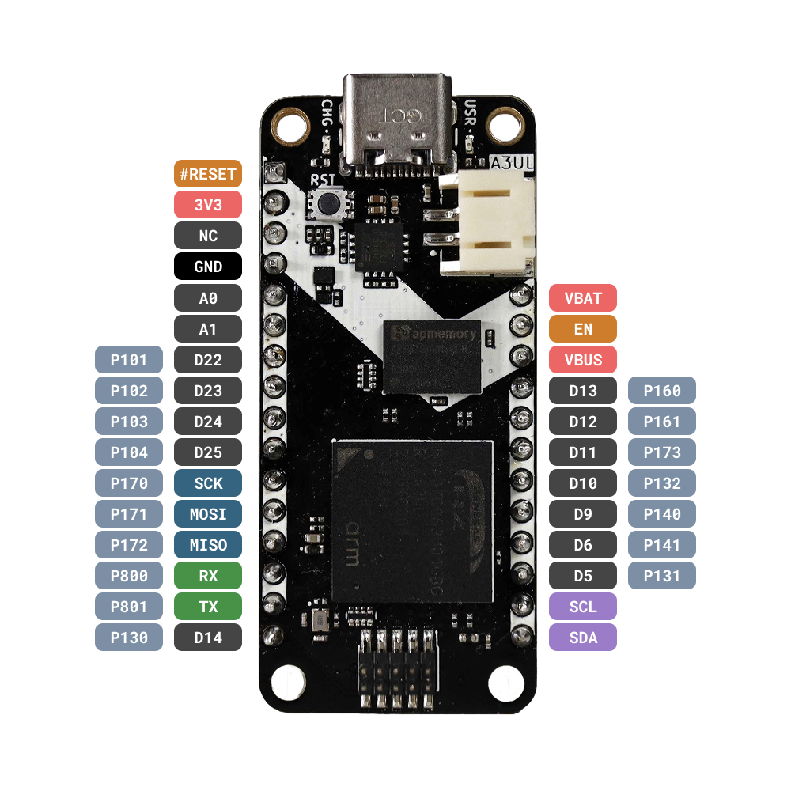
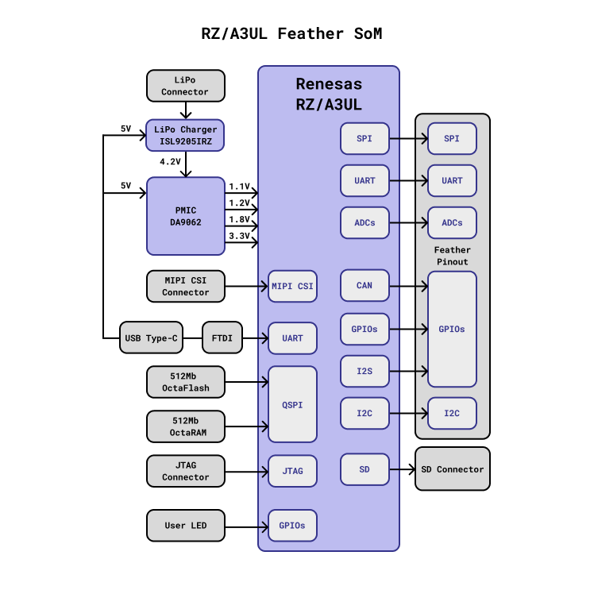

# Renesas RZA3UL Feather SoM 

Welcome to the <a href="https://zalmotek.com/products/RZA3UL-Feather-SoM/">Renesas RZA3UL Feather SoM</a> GitHub repository!

Here you'll find all the resources you need to get up and running quickly.

## 🪶 What is the RZA3UL Feather SoM?

The <a href="https://www.renesas.com/en/products/microcontrollers-microprocessors/rz-mpus/rza3ul-powerful-1ghz-64-bit-mpus-rtos-support-enables-high-definition-hmi-and-quick-startup">Renesas RZ/A3UL</a> allows you to achieve the full potential of a real-time operating system (RTOS) while leveraging the performance boost provided by the 64-bit Arm® Cortex®-A55 CPU core with a maximum operating frequency of 1 GHz. Integrating the 512Mbit OctaFlash and 512Mbit OctaRAM we conveniently packaged them in a Feather format.

Besides the processor, the Feather SoM contains the classic Feather features: digital GPIOs, I2C and SPI communication pins, UART pins, a LiPo battery power plug, and the USB programming port. The SoM also features a USB Type-C for powering the board and for USB debug upload.

  
  

## Feather Pinout

The pinout for each port is as follows:

| Pin | Function | Notes |
| :-- | :-- | :-- |
| 1   | RESET |  |
| 2   | VCC (3V3) |  |
| 3   | AREF |  |
| 4   | GND |  |
| 5   | A0 | ADC_CH0 |
| 6   | A1 | ADC_CH1 |
| 7   | D22 | BSP_IO_PORT_10_PIN_01 |
| 8   | D23 | BSP_IO_PORT_10_PIN_02 |
| 9   | D24 | BSP_IO_PORT_10_PIN_03 |
| 10  | D25 | BSP_IO_PORT_10_PIN_04 |
| 11  | SCK | BSP_IO_PORT_17_PIN_00 |
| 12  | MOSI | BSP_IO_PORT_17_PIN_01 |
| 13  | MISO | BSP_IO_PORT_17_PIN_02 |
| 14  | RX | BSP_IO_PORT_08_PIN_00 |
| 15  | TX | BSP_IO_PORT_08_PIN_01 |
| 16  | D14 | BSP_IO_PORT_13_PIN_00 |
| 17  | VBAT |  |
| 18  | EN |  |
| 19  | BUS |  |
| 20  | D13 | BSP_IO_PORT_16_PIN_00 |
| 21  | D12 | BSP_IO_PORT_16_PIN_01 |
| 22  | D11 | BSP_IO_PORT_17_PIN_03 |
| 23  | D10 | BSP_IO_PORT_13_PIN_02 |
| 24  | D9  | BSP_IO_PORT_14_PIN_00 |
| 25  | D6  | BSP_IO_PORT_14_PIN_01 |
| 26  | D5  | BSP_IO_PORT_13_PIN_01 |
| 27  | SCL | RIIC1_SCL |
| 28  | SDA | RIIC1_SDA |

## 🐣🏁 Quick Start Guide

### 🔌 Hardware Requirements
- USB-C cable
- JTAG Debugger, such as the <a href="https://www.segger.com/products/debug-probes/j-link/">SEGGER J-Link</a>

### 💻 Development Environment Setup

#### Installing Development Tools

The e² studio IDE from Renesas is a comprehensive, user-friendly platform designed to streamline embedded application development. It supports Renesas microcontrollers and combines powerful features with an intuitive interface for coding, debugging, and project management.

First of all, download the latest release of the Flexible Software Package with the e²studio platform installer from the following <a href="https://www.renesas.com/us/en/software-tool/e2studio-information-rz-family">link</a>, according to your OS.

The installer will guide you through the necessary steps. After the installation is finished, launch Renesas e² studio and set up your workspace. This will be the directory where all your projects will be stored.

You will also need to install the J-Link Software pack from <a href="https://www.segger.com/products/debug-probes/j-link/technology/flash-download/">here</a>.

#### Running your first project

Once you have all the tools installed, follow <a href="https://github.com/Zalmotek/renesas-RZA3UL-feather/tree/main/firmware/Blink/RZA3UL_Feather_Blink">this</a> guide to learn how to import, build, and run a project in the e² studio IDE. 

---
Thank you for choosing the Renesas RZA3UL Feather SoM! 

We can't wait to see what amazing projects you'll create with it! 💻✨
