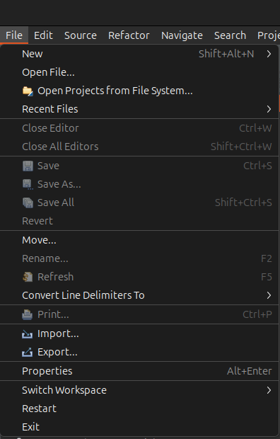
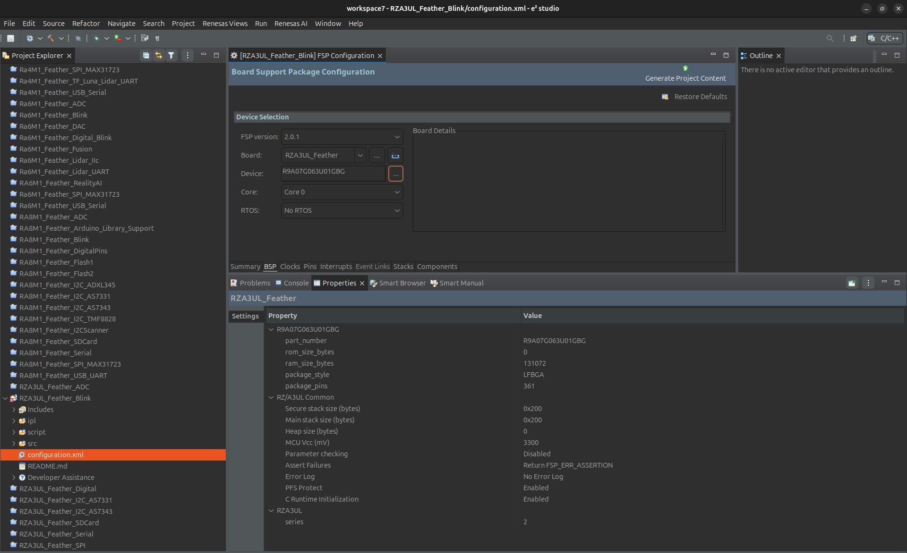
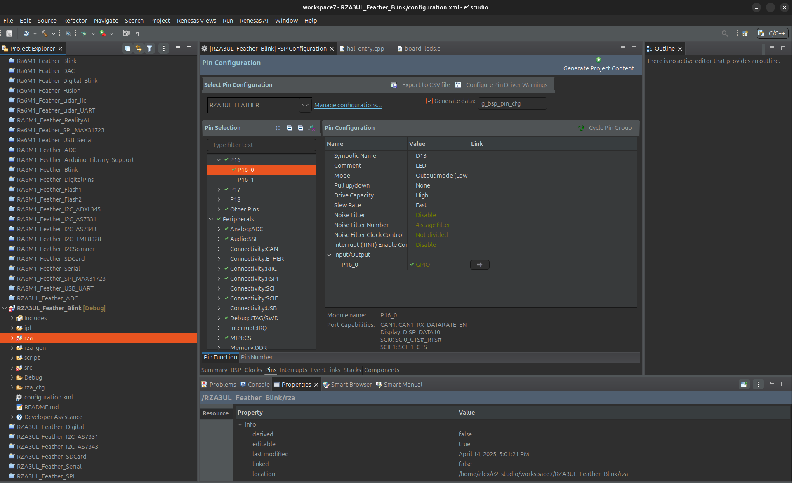

# Zalmotek RZA3UL Feather ADC Demo

A demonstration of Analog-to-Digital Conversion (ADC) functionality on the Zalmotek RZA3UL Feather board powered by Renesas.

## Overview

This project showcases the ADC capabilities of the Zalmotek RZA3UL Feather board featuring Renesas RZA3UL microcontroller. It demonstrates how to read analog values from multiple ADC channels (0 and 1) and convert the readings to voltage values.

## Hardware Requirements

- Zalmotek RZA3UL Feather board
- USB cable for power and communication
- Analog inputs (potentiometer, sensors, etc.) connected to ADC pins

## Software Requirements

- e² studio IDE
- FSP (Flexible Software Package)
- GCC ARM compiler

## Features

- Reading from multiple ADC channels
- Converting raw ADC values to voltage readings
- Serial communication for displaying readings
- Configurable ADC parameters

## Code Functionality

The main application:
- Initializes the ADC module for operation
- Implements Arduino-like analogRead() functions for ease of use
- Reads from ADC channels 0 and 1 in a continuous loop
- Displays both raw ADC values and converted voltage values via serial communication
- Handles window comparison events for voltage threshold monitoring
- Performs 12-bit ADC resolution with 3.3V reference voltage

## Getting Started

### Setup

1. Clone this repository
2. Open the project in e2 studio
   In e² studio go to File -> Import..., choose "Existing Projects into Workspace" and browse to the project you’ve just downloaded, then click Finish:
   
<p align="center">
  
  
</p>

After importing your project, open the configuration.xml file to access the board configurator. Let's review some key settings that will be relevant for all your future RA6M1 Feather SoM projects. First of all, in the BSP tab, your project should have the Custom User Board and the R7FA6M1AD3CFM device selected.

<p align="center">
  
</p>

Next, in the Pins tab, you may need to adjust this for future projects, based on what peripherals you want to enable. You can also set the pins as inputs or outputs and adjust their current drive capacity. For example, the LED is connected to P102 which is set to Output Mode. You can find its configuration in the Pin Selection menu ->Ports -> P3 -> P307.

<p align="center">
  
</p>

3. Connect your Zalmotek RA0E1 Feather board via USB
4. Build the project
5. Flash the firmware to the board
6. Open a serial terminal (115200 baud rate) to view the ADC readings

### Configuration

The ADC is configured with the following settings:

```c
#define ADC_12_BIT    (4096u)
#define V_ref         (3.3f)
#define ADC_H_LMT     (3103u)
#define ADC_L_LMT     (1241u)
```

## Project Structure

- `src/hal_entry.cpp`: Main entry point with application loop
- `src/adc.h`: ADC function implementations and definitions
- `src/SerialCompatibility.h`: Serial communication interface
- `configuration.xml`: Project configuration file

## License

[License information]

## Additional Resources

- [Zalmotek Website](https://zalmotek.com)
- [Zalmotek RZA3UL Website](https://zalmotek.com/products/RZA3UL-Feather-SoM/)
