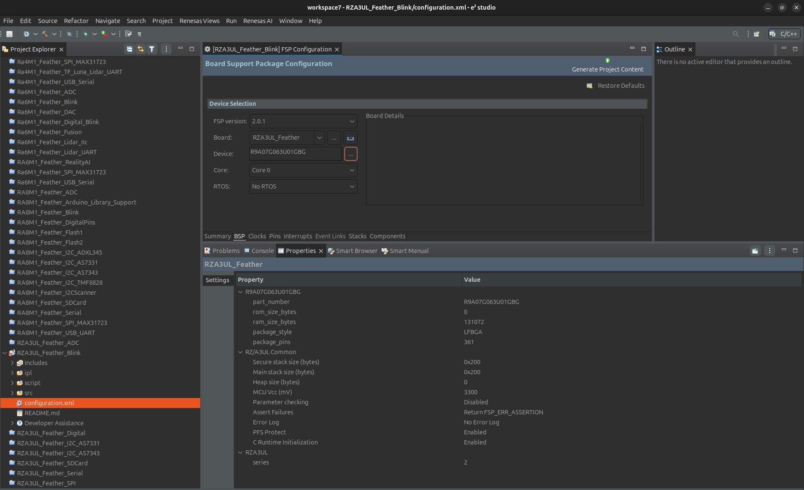
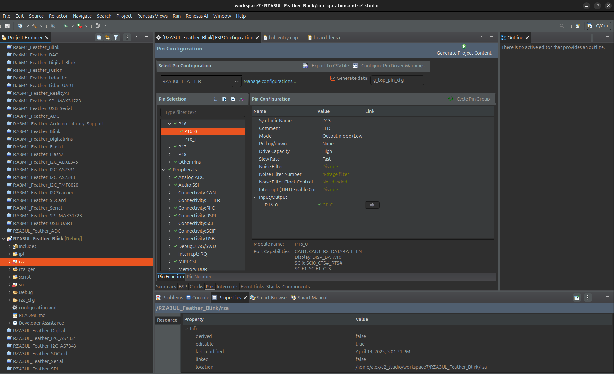

# Zalmotek RZA3UL Feather Blink

A simple LED blinking example for the Zalmotek RZA3UL Feather board powered by Renesas R9A07G063U01GBG microcontroller.

## Overview

This project demonstrates a basic LED blinking functionality on the Zalmotek RZA3UL Feather board. It uses the onboard LEDs to create a visual indicator by toggling them at a regular interval. The project showcases basic GPIO control using the Renesas RZA3UL microcontroller.

## Hardware Requirements

- Zalmotek RZA3UL Feather board
- USB cable for power and programming

## Software Requirements

- Renesas e² studio IDE
- GCC ARM A-Profile AArch64 Toolchain (10.3.1.20210621)
- Renesas FSP (Flexible Software Package) version 2.0.1

## Features

- Simple LED blinking at 200ms intervals
- Demonstrates GPIO pin configuration and control
- Shows how to use the BSP delay functionality
- Minimal code example for RZA3UL hardware

## Code Functionality

The main application:
- Initializes the IOPORT for pin access
- Enables pin access with R_BSP_PinAccessEnable()
- Sets up a continuous loop that toggles LED states between HIGH and LOW
- Uses a 200ms delay between state changes for visible blinking
- Properly configures the MMU during system startup

## Getting Started

### !!!To start using the RZA3UL FEATHER, it is necessary to integrate the pack into e2studio. 

To do this, in e2 studio, from the Help menu, choose About E2studio -> Installation Details, from there choose Support Folders > e2 studio support area -> Internal, and add our files to each representative folder.
https://github.com/Zalmotek/renesas-RZA3UL-feather/tree/main/internal

### Setup

1. Clone this repository
2. Open the project in e2 studio
   In e² studio go to File -> Import..., choose "Existing Projects into Workspace" and browse to the project you’ve just downloaded, then click Finish:
   
<p align="center">
  
  
</p>

After importing your project, open the configuration.xml file to access the board configurator. Let's review some key settings that will be relevant for all your future RZA3UL Feather SoM projects. First of all, in the BSP tab, your project should have the Custom User Board and the R9A07G063U01GBG device selected.

<p align="center">
  
</p>

Next, in the Pins tab, you may need to adjust this for future projects, based on what peripherals you want to enable. You can also set the pins as inputs or outputs and adjust their current drive capacity. For example, the LED is connected to P102 which is set to Output Mode. You can find its configuration in the Pin Selection menu ->Ports -> P16 -> P16_00.

<p align="center">
  
</p>

3. Connect your Zalmotek RA0E1 Feather board via USB
4. Build the project
5. Flash the firmware to the board
6. The onboard LEDs should begin blinking with a 200ms interval

### Configuration

The LED pin configuration is handled by the BSP:

```c
// Access the LED via the BSP LED structure
bsp_leds_t leds = g_bsp_leds;

// Toggle LED states
for (uint32_t i = 0; i < leds.led_count; i++) {
    uint32_t pin = leds.p_leds[i];
    R_BSP_PinWrite((bsp_io_port_pin_t) pin, pin_level);
}
```

## Project Structure

- `src/hal_entry.cpp`: Main application code with the LED blinking logic
- `src/mmu_page_table.c`: MMU configuration for the RZA3UL
- `src/sections.c`: Memory section definitions
- `configuration.xml`: Project configuration file

## License

[License information to be added]

## Additional Resources

- [Zalmotek Website](https://zalmotek.com)
- [Zalmotek RZA3UL Website](https://zalmotek.com/products/RZA3UL-Feather-SoM/)
